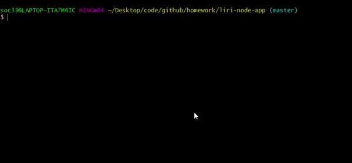
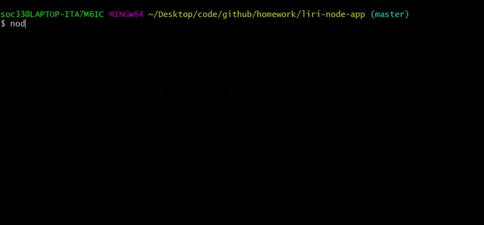
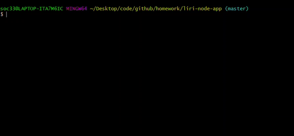
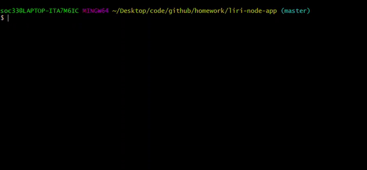
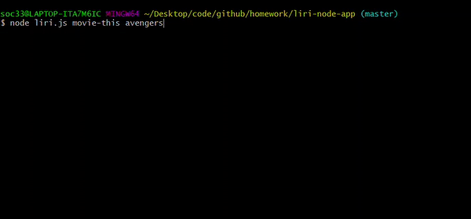
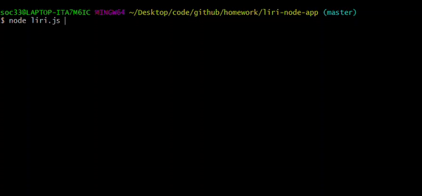

# liri-node-app

### Language-Interpretation-Recognition-Interface

#### You guessed it, Liri is an alternate version of Siri, you've stepped into... the coding zone

## LIRI can do **many** things like: 
 - tell you, that you're wrong:
 
 
 
 - tell you what your real options are:
 
 
 
 > A computer once beat me at chess, but it was no match for me at kickboxing.
 > - Emo Philips
 
 ## Once you've decided on a real option this is how that looks:
 
 - Providing concert information

 

 - Providing song information

 

 - Providing song information when you forgot to tell it which song...

 
 
 - Providing movie information

  

 - Providing movie information when you forgot to tell it which movie...
 
 

 - Do whatever is written in a separate file (Like a small surprise) **AND** Then if you don't like the surprise, you can change it!

  
